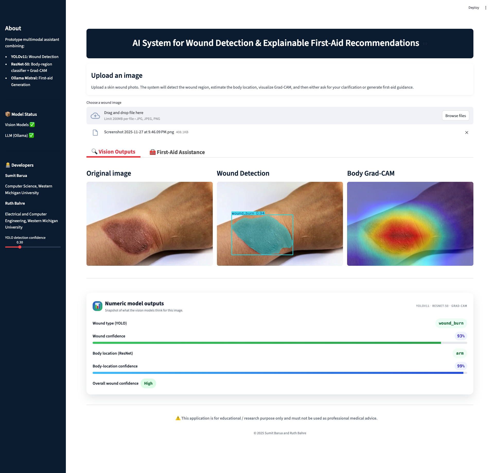
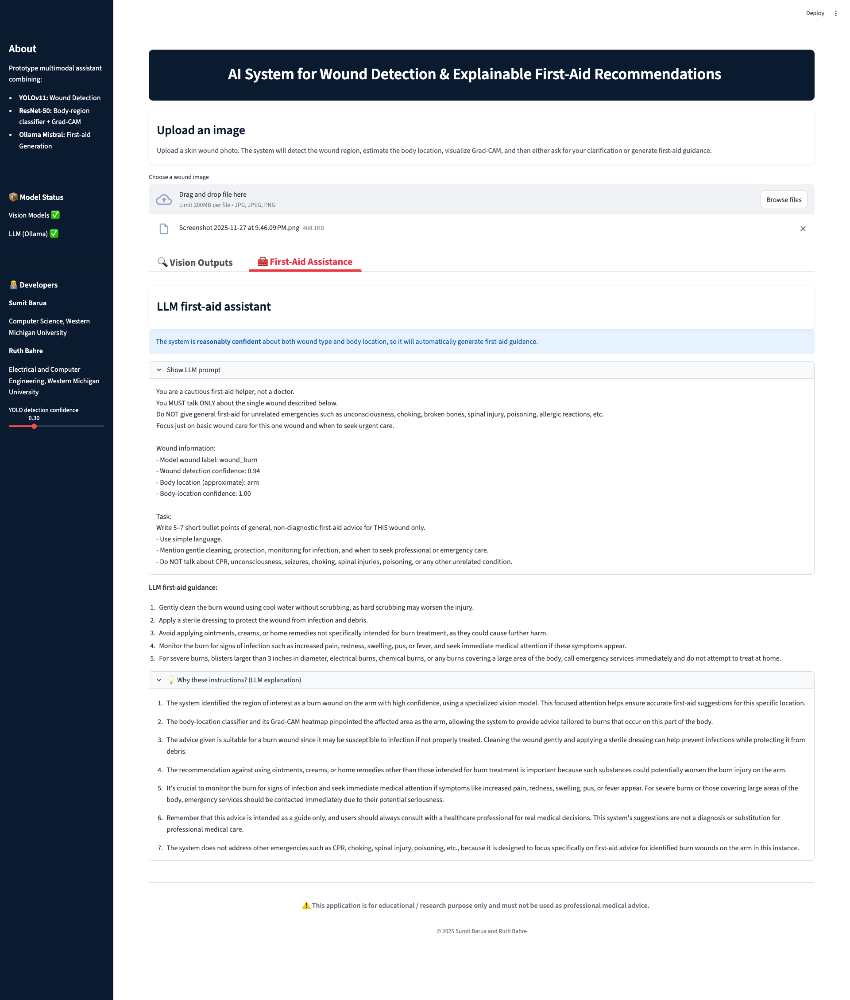

# 🩹 Explainable Hybrid Multimodal Framework for Remote Wound Detection and First-Aid Recommendation

---

## 🧭 Overview
This project implements an **explainable hybrid multimodal AI framework** that integrates computer vision with large language models (LLMs) for automated wound assessment and transparent first-aid guidance. The system combines **YOLOv11 segmentation** for wound localization and **ResNet-50** for anatomical context understanding, enhanced with **dual-stage explainability** through Grad-CAM visualizations and LLM-generated natural language rationales.

When the model is uncertain about a wound’s type or body location, it triggers an interactive clarification step—asking the user for more input before providing instructions.
This ensures safer, explainable, and human-in-the-loop decision support

---

## 🖼 Demo

<p align="center">
  
  
</p>

<sub>Full interface showing detection, explainability (Grad-CAM), and LLM-based first-aid generation.</sub>

---

## ⚙️ Key Features
### 🔍 **Multimodal Wound Analysis**
- **YOLOv11-Segmentation**: Real-time wound detection and classification across four categories (`wound_cut`, `wound_burn`, `healthy_skin`, `wound_unknown`)
- **ResNet-50 Body Classification**: Anatomical region prediction (`arm`, `hand`, `leg`, `other`) with Grad-CAM interpretability
- **Custom Datasets**: 2,135 wound images + 2,112 body location images with manual annotations

### 🛡️ **Safety-Aware LLM Integration**
- **Mistral-7B (Local)**: Privacy-preserving, offline-first first-aid generation via Ollama
- **Confidence-Aware Routing**: Automatic clarification mode triggered when:
  - Wound class = `wound_unknown`
  - Confidence scores < 0.70 threshold
  - Body region = `other` category
- **Structured Prompting**: Incorporates vision outputs, Grad-CAM cues, and explicit safety constraints

### 📊 **Dual-Stage Explainability**
- **Vision-XAI**: Grad-CAM heatmaps for spatial interpretability of body region predictions
- **LLM-XAI**: Natural language rationales explaining recommendation logic based on wound characteristics and anatomical context
- **Token-level Attribution**: Highlights key factors influencing first-aid decisions

### 🌐 **Deployment-Ready Architecture**
- **Streamlit Interface**: Real-time web application for image upload and analysis
- **Offline Operation**: Complete local processing for privacy and resource-constrained environments
---

## 🧬 System Architecture

1. **Image Input** → User uploads wound image via web interface
2. **Vision Processing** → YOLOv11 segmentation + ResNet-50 body classification
3. **Confidence Evaluation** → Uncertainty detection and routing logic
4. **Interactive Clarification** → User input requested for ambiguous cases
5. **LLM Inference** → Mistral-7B generates first-aid recommendations
6. **Explainability Generation** → LLM-XAI produces human-readable rationales
7. **Output Delivery** → Structured first-aid guidance with transparency reports

```brew
Vision Input
↓
YOLOv11-Segmentation (Wound Detection)
↓
ResNet-50 + Grad-CAM (Body Location)
↓
Confidence-Aware Routing
↓
Clarification Mode (if uncertain)
↓
Structured Prompt Construction
↓
Mistral-7B + LLM-XAI
↓
First-Aid Recommendations + Rationales
```


## 📁 Project Structure
```bash
wound_detection_app/
│
├── assets/
│ └── ui.png                        # App demo screenshot / banner
│
├── app/
│ └── app.py                        # Streamlit web UI
│
├── datasets/
│ └── data.yaml                     # YOLO dataset configuration
│
├── models/
│ └── wound_yolo_seg_final.pt       # Trained YOLO segmentation model
│
├── src/
│ ├── config.py                     # Model/config paths
│ ├── prompts.py                    # LLM prompt templates
│ ├── detection/
│ │ ├── 01_prepare_dataset.py       # (optional) preprocessing
│ │ ├── 02_balance_and_augment.py   # Class balancing + augmentations
│ │ ├── 03_train_yolov8.py          # Training pipeline
│ │ └── yolo_infer.py               # Detection + wound_unknown logic
│ ├── llm/
│ │ └── first_aid.py                # LLM-based first-aid generation
│ └── xai/
│   ├── gradcam.py                  # Grad-CAM visualization
│   └── bbox_xai.py                 # optional bounding box visualization
│
├── xai_results/                    # Grad-CAM or heatmap outputs
├── report/                         # For course documentation
├── .env.example                    # Environment variable template
├── requirements.txt                # Core dependencies
└── README.md
```

---

## ⚙️ Installation

### 1️⃣ Clone the Repository

```bash
git clone https://github.com/sum1tbarua/wound_detection_app.git
cd wound_detection_app
```

### 2️⃣ Create and Activate a Virtual Environment
```bash
python -m venv .venv
source .venv/bin/activate      # macOS/Linux
# OR
.venv\Scripts\activate         # Windows
```

### 3️⃣ Install Dependencies
```bash
pip install -r requirements.txt
```
--- 
## 🔑 Install Ollama
### macOS/Linux
```brew
brew install ollama
ollama serve
```
### Windows
```brew
Download and install from 👉 https://ollama.ai/download
```
### Pull a local model
Ollama hosts several open LLMs.
We recommend the lightweight and high-quality Mistral 7B:
```brew
ollama pull mistral
```
To verify
```brew
ollama list
```
### Configure your .env
Copy the provided .env.example to .env and set:
```brew
LLM_PROVIDER=ollama
OLLAMA_MODEL=mistral
```
---
## Model Setup
No external downloads required — the trained YOLOv11 segmentation model (`models/yolo_best.pt`, 24 MB) is included in this repository for reproducibility.

---
## ▶️ Run the App
Keep Ollama running (in one terminal):
```brew
ollama serve
```
Then, in a new terminal window, run the Streamlit app:
```bash
streamlit run app/app.py
```
You'll see something like:
```brew
Local URL: http://localhost:8501
Using local model: mistral (Ollama)
```
---
## 🧪 How It Works
1. Upload a wound image (hand, leg, or arm).
2. YOLOv8 detects wounds and classifies them into:
    - leg_cut, leg_burn, healthy_leg
    - hand_cut, hand_burn, healthy_hand
    - arm_cut, arm_burn, healthy_arm
    - or wound_unknown (for uncertain cases)

3. XAI/Grad-CAM visualizes model attention (optional).

4. LLM (Mistral) generates Markdown-formatted first-aid instructions.
    - If wound_unknown, GPT politely asks for clarification.
    - If confident, GPT outputs detailed care steps.

## Explainable AI (Grad-CAM)
1. Input: Original wound images
2. Output: Red-tinted heatmaps showing model attention
3. Directory: xai_results/

    This provides visual transparency — letting users see why the model made a decision.


## 🧠 Example Output
### If model is confident:
#### Assesment
    - Detected: hand_cut
    - Confidence: 0.87

#### First-Aid Steps
    1. Clean the wound with clean water.
    2. Apply mild antiseptic.
    3. Cover with a sterile bandage.


#### If uncertain (wound_unknown)
    - The model isn’t fully sure about the wound type. 
    - Could you confirm whether this is a burn or a cut?

---
## 🤖 What to Expect
> ⚠️ Note: This prototype uses a limited, custom dataset.
Under unusual lighting or viewing angles, the model may classify an image as wound_unknown.
In such cases, the LLM engages the user for clarification — a deliberate human-in-the-loop design for safety and reliability.

---

## Test with Provided Samples
Use any image from the **samples/** directory to verify the workflow.
You’ll see:

1. Detection overlay

2. Grad-CAM explanation

3. Generated first-aid guidance

---
## Future Directions

🧬 Integrate infection-risk classification

📈 Deploy on Streamlit Cloud or HuggingFace Spaces

🧑‍⚕️ Integrate EHR/FHIR-compatible data interface for hospitals

🗣️ Expand LLM context to multi-modal dialogue for first-aid triage

## 👨‍💻 Author(s)

 - Sumit Barua
 Graduate Student, Department of Computer Science, 
 Western Michigan University, 📧 sumit.barua@wmich.edu

 - Ruth Bahre,
 Graduate Student, Department of Electrical and Computer Engineering, 
 Western Michigan University, 📧 ruth.bahre@wmich.edu


## 📜 License

<p align="center">
This project is for academic and research purposes only.
</p>
<p align="center">
©2025 Sumit Barua and Ruth Bahre. All rights reserved.
</p>