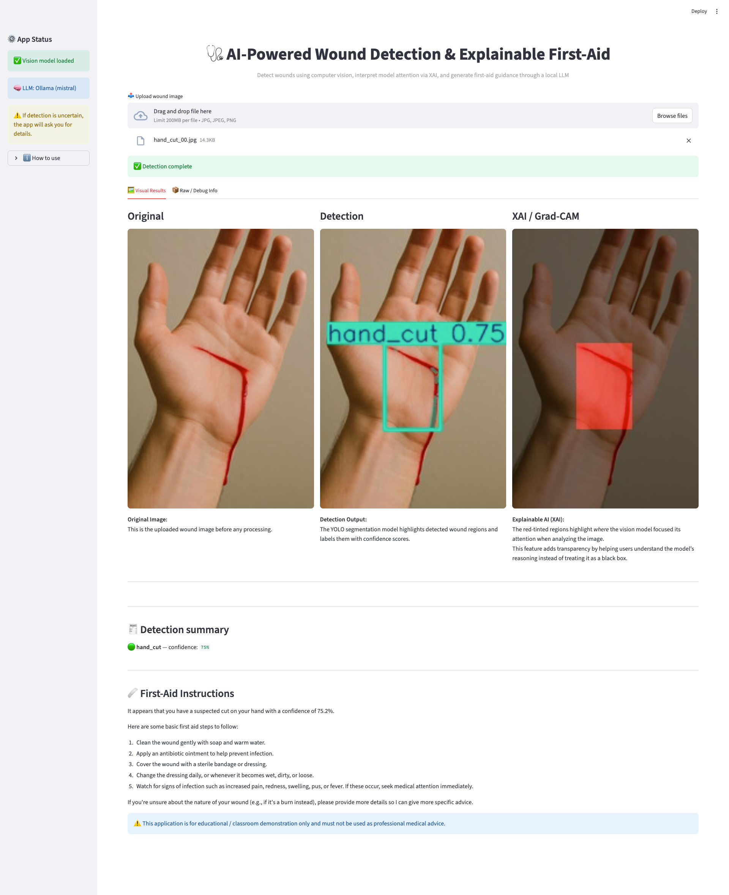

# 🩹 Hybrid AI System for Wound Detection & Explainable First-Aid Recommendations
### An Explainable Hybrid Computer Vision and Generative AI Framework

---

## 🧭 Overview
This project is a hybrid AI application that integrates Computer Vision **YOLOv8 Segmentation** and a local Generative Language Model **Mistral via Ollama** to automate wound detection and generate context-aware first-aid recommendations.

When the model is uncertain about a wound’s type or body location, it triggers an interactive clarification step—asking the user for more input before providing instructions.
This ensures safer, explainable, and human-in-the-loop decision support

---

## 🖼 Demo

<p align="center">
  
</p>

<sub>Full interface showing detection, explainability (Grad-CAM), and LLM-based first-aid generation.</sub>

---

## ⚙️ Key Features
- 🧠 **Hybrid Vision + Language System**

    Combines YOLOv8 segmentation with a local LLM for contextual response generation.
- 💬 **LLM-powered contextual first-aid generation**

    Generates Markdown-formatted medical guidance dynamically (no hardcoded text).
- 🔍 Explainable AI (XAI / Grad-CAM)

    Displays heatmaps showing where the vision model focused when detecting wounds.

- 🔍 **Uncertainty handling**  

  Uses wound_unknown class — triggers interactive clarification when confidence is low.

- 🖼️ **Streamlit Web Interface** 

    Simple, interactive demo for uploading images and viewing multi-modal outputs.

- 🧩 **Clean Modular Codebase** 
    Organized, research-friendly, and ready for extension or publication.
---

## 🧬 System Architecture
```brew
[ Uploaded Image ]
        ↓
YOLOv8 Segmentation → Detected Classes → XAI Heatmap
        ↓
Structured Detections (JSON)
        ↓
LLM (Ollama Mistral)
        ↓
Generated Context-Aware First-Aid Instructions
```

## 📁 Project Structure
```bash
wound_detection_app/
│
├── app/
│ └── app.py                        # Streamlit web UI
│
├── dataset/
│ └── raw/wound-yolo/               # Roboflow-exported YOLO dataset
│ ├── train/
│ ├── valid/
│ ├── test/
│ └── data.yaml
│
├── models/
│ └── wound_yolo_seg_final.pt       # Trained YOLO segmentation model
│
├── src/
│ ├── config.py                     # Model/config paths
│ ├── prompts.py                    # LLM prompt templates
│ ├── detection/
│ │ ├── 01_prepare_dataset.py       # (optional) preprocessing
│ │ ├── 02_balance_and_augment.py   # Class balancing + augmentations
│ │ ├── 03_train_yolov8.py          # Training pipeline
│ │ └── yolo_infer.py               # Detection + wound_unknown logic
│ └── llm/
│ └── first_aid.py                  # LLM-based first-aid generation
│
├── xai_results/                    # Grad-CAM or heatmap outputs
├── report/                         # For course documentation
├── .env.example                    # Environment variable template
├── requirements.txt                # Core dependencies
└── README.md
```

---

## ⚙️ Installation

### 1️⃣ Clone the Repository

```bash
git clone https://github.com/<your-username>/wound_detection_app.git
cd wound_detection_app
```

### 2️⃣ Create and Activate a Virtual Environment
```bash
python -m venv .venv
source .venv/bin/activate      # macOS/Linux
# OR
.venv\Scripts\activate         # Windows
```

### 3️⃣ Install Dependencies
```bash
pip install -r requirements.txt
```
--- 
## 🔑 Install Ollama
### macOS/Linux
```brew
brew install ollama
ollama serve
```
### Windows
```brew
Download and install from 👉 https://ollama.ai/download
```
### Pull a local model
Ollama hosts several open LLMs.
We recommend the lightweight and high-quality Mistral 7B:
```brew
ollama pull mistral
```
To verify
```brew
ollama list
```
### Configure your .env
Copy the provided .env.example to .env and set:
```brew
LLM_PROVIDER=ollama
OLLAMA_MODEL=mistral
```
---
## Model Setup
No external downloads required — the trained YOLOv8 segmentation model (`models/wound_yolo_seg_final.pt`, 24 MB) is included in this repository for reproducibility.

---
## ▶️ Run the App
Keep Ollama running (in one terminal):
```brew
ollama serve
```
Then, in a new terminal window, run the Streamlit app:
```bash
streamlit run app/app.py
```
You'll see something like:
```brew
Local URL: http://localhost:8501
Using local model: mistral (Ollama)
```
---
## 🧪 How It Works
1. Upload a wound image (hand, leg, or arm).
2. YOLOv8 detects wounds and classifies them into:
    - leg_cut, leg_burn, healthy_leg
    - hand_cut, hand_burn, healthy_hand
    - arm_cut, arm_burn, healthy_arm
    - or wound_unknown (for uncertain cases)

3. XAI/Grad-CAM visualizes model attention (optional).

4. LLM (Mistral) generates Markdown-formatted first-aid instructions.
    - If wound_unknown, GPT politely asks for clarification.
    - If confident, GPT outputs detailed care steps.

## Explainable AI (Grad-CAM)
1. Input: Original wound images
2. Output: Red-tinted heatmaps showing model attention
3. Directory: xai_results/

    This provides visual transparency — letting users see why the model made a decision.


## 🧠 Example Output
### If model is confident:
#### Assesment
    - Detected: hand_cut
    - Confidence: 0.87

#### First-Aid Steps
    1. Clean the wound with clean water.
    2. Apply mild antiseptic.
    3. Cover with a sterile bandage.


#### If uncertain (wound_unknown)
    - The model isn’t fully sure about the wound type. 
    - Could you confirm whether this is a burn or a cut?

---
## 🤖 What to Expect
> ⚠️ Note: This prototype uses a limited, custom dataset.
Under unusual lighting or viewing angles, the model may classify an image as wound_unknown.
In such cases, the LLM engages the user for clarification — a deliberate human-in-the-loop design for safety and reliability.

---
## Future Directions

🧬 Integrate infection-risk classification

📈 Deploy on Streamlit Cloud or HuggingFace Spaces

🧑‍⚕️ Integrate EHR/FHIR-compatible data interface for hospitals

🗣️ Expand LLM context to multi-modal dialogue for first-aid triage

## 👨‍💻 Author(s)

 - Sumit Barua
 Master’s Student, Department of Computer Science, 
 Western Michigan University, 📧 sumit.barua@wmich.edu

 - Ruth Bahre
 Master’s Student, Department of Electrical and Computer Engineering, 
 Western Michigan University, 📧 ruth.bahre@wmich.edu


## 📜 License

This project is for academic and research purposes only.

© 2025 Sumit and Ruth. All rights reserved.